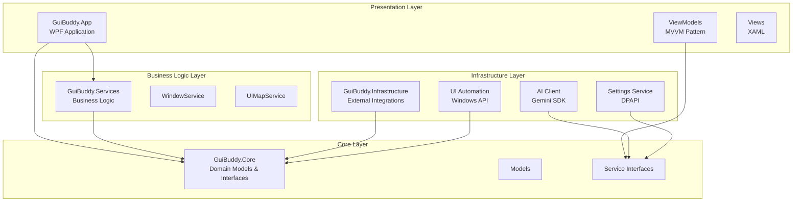
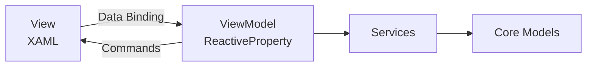
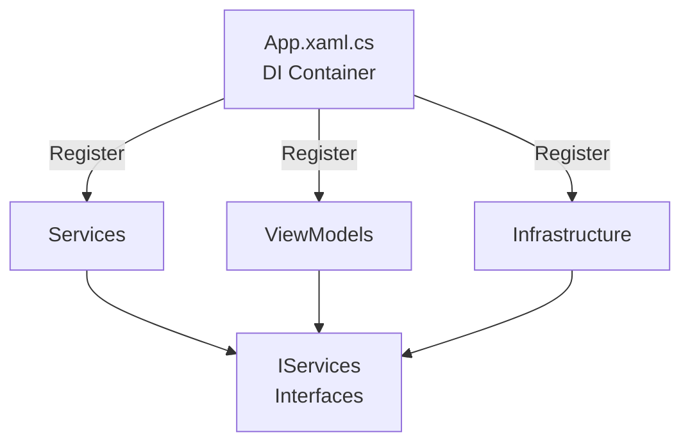
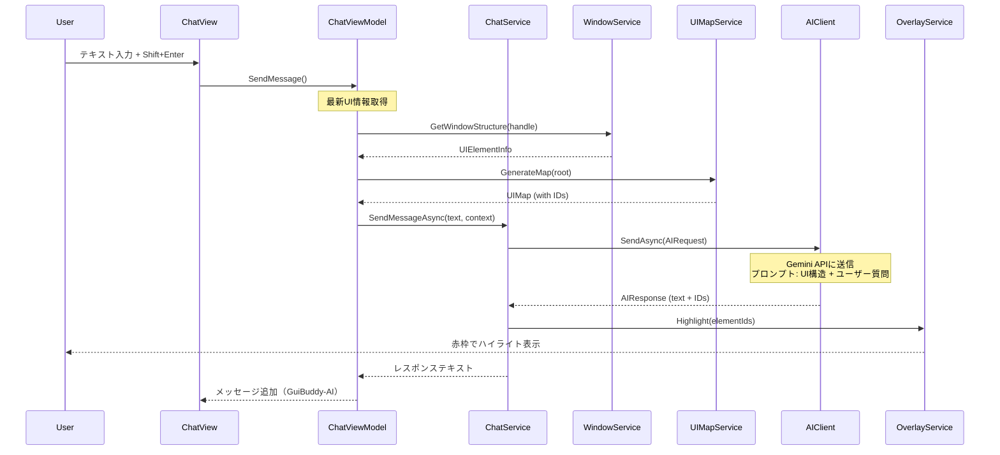
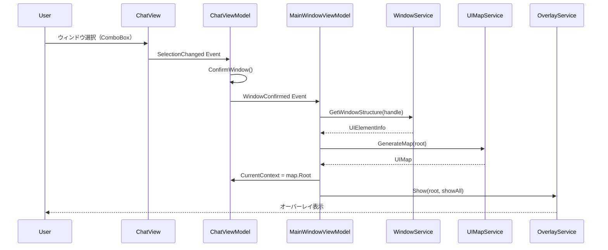
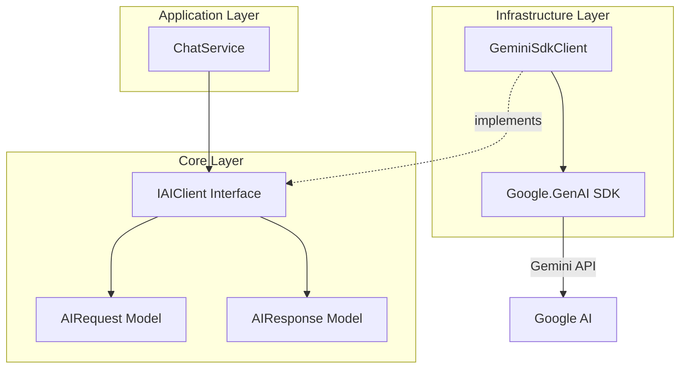
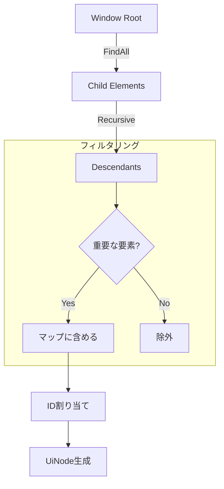
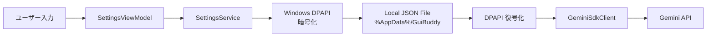

# GuiBuddy 設計書

## 目次
1. [概要](#概要)
2. [システムアーキテクチャ](#システムアーキテクチャ)
3. [レイヤー構成](#レイヤー構成)
4. [コンポーネント設計](#コンポーネント設計)
5. [データフロー](#データフロー)
6. [AI統合](#ai統合)
7. [UI Automation](#ui-automation)

## 概要

GuiBuddyは、Clean Architectureの原則に基づいたレイヤー型アーキテクチャを採用しています。各レイヤーは明確な責務を持ち、依存関係は内側（Core）から外側（Infrastructure/App）への単方向です。

### 設計原則
- **依存性逆転の原則**: CoreレイヤーはインターフェースのみToを定義、実装は外側のレイヤーで提供
- **関心の分離**: UI、ビジネスロジック、インフラストラクチャを明確に分離
- **テスト容易性**: インターフェースによる抽象化でモックテストを容易に実現

## システムアーキテクチャ



## レイヤー構成

### 1. GuiBuddy.Core（コアドメイン層）

**責務**: ドメインモデルとインターフェース定義

**主要コンポーネント**:
- `Models/`: ドメインモデル
  - `UiNode`: UI要素ツリーノード
  - `UIMap`: UI構造マップ
  - `WindowInfo`: ウィンドウ情報
  - `ChatMessage`: チャットメッセージ
  - `AIRequest/AIResponse`: AI通信モデル
- `Services/`: サービスインターフェース
  - `IWindowService`: ウィンドウ管理
  - `IUIMapService`: UIマッピング
  - `IAIClient`: AI統合
  - `ISettingsService`: 設定管理
  - `IChatService`: チャット機能

**依存関係**: なし（他のレイヤーに依存しない）

### 2. GuiBuddy.Services（ビジネスロジック層）

**責務**: ビジネスロジックの実装

**主要コンポーネント**:
- `WindowService`: ウィンドウ管理ロジック
  - UI Automationを使用してウィンドウ情報を取得
  - ウィンドウ構造をツリー形式で走査
- `UIMapService`: UI構造のマッピング
  - UI要素ツリーを解析
  - AI用の最適化されたマップを生成
  - 重要な要素の抽出とフィルタリング
- `OverlayService`: オーバーレイ表示管理

**依存関係**: GuiBuddy.Core

### 3. GuiBuddy.Infrastructure（インフラストラクチャ層）

**責務**: 外部システムとの統合

**主要コンポーネント**:

#### AI統合
- `GeminiSdkClient`: Google Gemini API統合
  - 公式SDKを使用したAI通信
  - プロンプト構築（UI構造+ユーザークエリ）
  - レスポンス解析（ハイライトID抽出）
- `MockAIClient`: テスト用モッククライアント

#### 設定管理
- `SettingsService`: APIキー等の設定管理
  - Windows DPAPIによる暗号化保存
  - ローカルJSONファイルへの永続化

#### UI Automation
- `AutomationWindowRepository`: UI Automation API統合
  - ウィンドウ列挙
  - UI要素ツリー走査
  - 要素プロパティ取得

**依存関係**: GuiBuddy.Core, 外部SDK (Google.GenAI)

### 4. GuiBuddy.App（プレゼンテーション層）

**責務**: ユーザーインターフェース

**主要コンポーネント**:

#### ViewModels (MVVM)
- `MainWindowViewModel`: メインウィンドウ制御
- `ChatViewModel`: チャット機能
  - メッセージ管理
  - ウィンドウ選択
  - 送信時のUI更新
- `SettingsViewModel`: 設定画面

#### Views (XAML)
- `MainWindow`: メインウィンドウUI
- `ChatView`: チャットパネル
- `SettingsWindow`: 設定ダイアログ
- `OverlayWindow`: ハイライトオーバーレイ

#### Services
- `ChatService`: チャットロジック統合

**依存関係**: GuiBuddy.Core, GuiBuddy.Services, GuiBuddy.Infrastructure

## コンポーネント設計

### MVVM パターン



### 依存性注入



## データフロー

### チャットメッセージ送信フロー



### ウィンドウ選択フロー



## AI統合

### Gemini SDK 統合アーキテクチャ



### プロンプト構造

```
System Instruction:
あなたはGUI操作アシスタントです。
提供されたUI構造を分析し、ユーザーの要望に合致する要素を特定してください。
回答の最後に [HIGHLIGHT:ID] の形式で要素IDを付記してください。

User Message:
{ユーザーの質問}

Current UI Context:
{UI構造ツリー（JSON形式）}
```

### レスポンス解析

正規表現: `\[HIGHLIGHT:\s*(\d+)\]` (大文字小文字区別なし)

抽出されたIDリストを`OverlayService`に渡してハイライト表示

## UI Automation

### UI要素ツリー走査



### 重要な要素タイプ
- Button, Edit, CheckBox, RadioButton
- ComboBox, List, ListItem
- Tree, TreeItem, MenuItem
- TabItem, Hyperlink, DataGrid

### 除外される要素タイプ
- Image, Border, Separator
- ScrollBar, Thumb, TitleBar

## セキュリティ

### APIキー管理



**特徴**:
- Windows DPAPI (Data Protection API) による暗号化
- ユーザープロファイル専用の暗号化キー
- ローカルファイルシステムへの保存
- プレーンテキストでの保存なし

## 拡張性

### 新しいAIプロバイダーの追加

1. `IAIClient` インターフェースを実装
2. DI登録を変更
3. 既存コードの変更不要（依存性逆転の原則）

### 新しいUI要素タイプのサポート

1. `UIMapService` のフィルタリングロジックを更新
2. `InterestingTypes` セットに追加

### マルチプラットフォーム対応（将来）

- Core/Services層はプラットフォーム非依存
- Infrastructure層のみ置き換え（UI Automation → 他のAPI）
